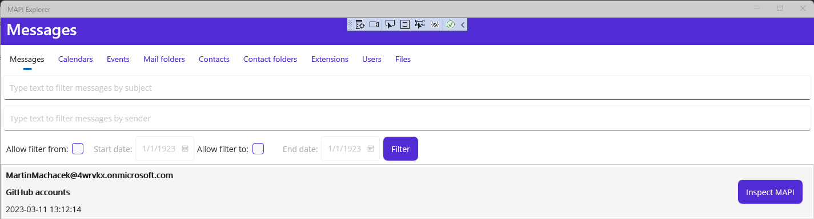
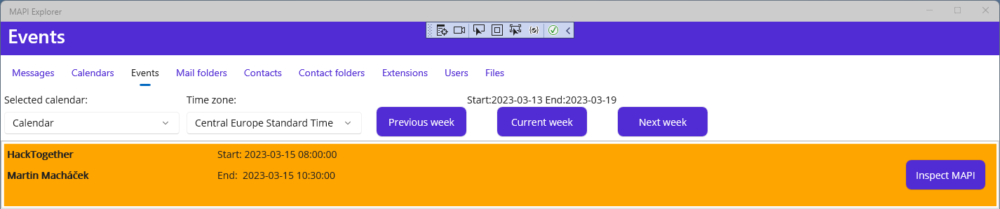
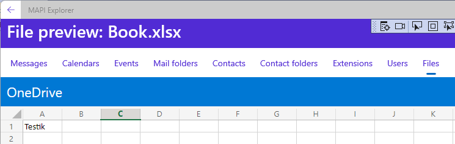

# Graph MAPI Explorer
[](https://github.com/microsoft/hack-together)

## Project description

The application aims to explore Graph API with the latest version of Graph .NET SDK integrated into the MAUI app. 

Since version 5 there is a new way of model and client generation (Kiota) and it's good to be familiar with the latest SDK and find out what has been changed and what are the benefits of SDK version 5.

The main focus is on extended properties :

- MAPI properties accessible through single-value/multi-value extended properties on `message`, `event`, `calendar`, `mailFolder`, `contact` and `contactFolder` resources
- schema extensions
- extension properties
 

### Schema extensions
The app allows to list [schema extensions](https://learn.microsoft.com/en-us/graph/api/resources/schemaextension?view=graph-rest-1.0) and filter extensions by a name. 

You can create one schema extension for `user` resource called `githubaccounts` with two properties `workaccount` and `personalaccount`.

It's quite common that employees working for IT companies must have work account for GitHub. Very often many employees also have a personal GitHub account.

The app allows to edit both accounts for all users. 
The values are saved to schema extension on the instance of `user` resource.

### Extension property

Because the name of the extension schema is generated by Graph API and is more or less random I decided to use [extension property](https://learn.microsoft.com/en-us/graph/api/resources/extensionproperty?view=graph-rest-1.0) of [application](https://learn.microsoft.com/en-us/graph/api/resources/application?view=graph-rest-1.0) resource to store the name of `githubaccounts` schema extension.

I chose this option to try out how to easy/hard are basic operations with extension properties in SDK v5.

### MAPI properties
Main focus is on [MAPI properties](https://learn.microsoft.com/en-us/office/client-developer/outlook/mapi/mapi-properties?source=recommendations). The app allows to list and filter user's messages, events, calendars, mail folders, contacts and contacts folders.

[Single-value and multi-value extended properties](https://learn.microsoft.com/en-us/graph/api/resources/extended-properties-overview?view=graph-rest-1.0) allow storing custom data and specifically serve as a fallback mechanism for apps to access custom data for Outlook MAPI properties.

For each resource mentioned above you can inspect [MAPI properties](https://learn.microsoft.com/en-us/office/client-developer/outlook/mapi/mapi-canonical-properties#naming-conventions). 

You can inspect 

- [MAPI property tags](https://learn.microsoft.com/en-us/office/client-developer/outlook/mapi/mapi-property-tags)
- property lid 
- named properties
- custom named properties

The app displays details of selected properties: 
- id
- name
- type
- property set
- value of single-value/multi-value
- [valid id formats](https://learn.microsoft.com/en-us/graph/api/resources/extended-properties-overview?view=graph-rest-1.0#id-formats) for single-value/multi-value extended properties
- Graph API query to read value

You can edit the value of named properties.

#### Configure MAPI properties to be inspected
Application allows to configure which MAPI properties and for which resource should be displayed in UI.

The configuration is stored in `Resources/Raw/pidpropertiesmapping.json` file. 
There are four dictionaries. Possible keys for each dictionary are: `Messagges`, `Events`, `Calendars`, `ContactFolders`, `Contacts`, `MailFolders`.

Possible values are either pid tag, pid lid, pid name or custom name.

Example:

```JSON
{
  "ResourceTagProperties":{
    "Messages":[
      "PidTagEntryId",
      ...
    ],
    ...
  },
  "ResourceLidProperties":{
    "Messages":[
      "PidLidCommonStart",
      ...
    ],
    ...
  },
  "ResourceNamedProperties":{
    "Messages":[
      "PidNameMessageId",
      ...
    ],
    ...
  },
  "ResourceCustomNamedProperties":{
    "Messages":[
      "InternalSystemId",
      ...
    ],
    ...
  }
}
```

Check [PidLidProperties.cs](MapiExplorer.Models/MAPI/PidLidProperties.cs), [PidNameProperties.cs](MapiExplorer.Models/MAPI/PidNameProperties.cs) and [PidTagProperties.cs](MapiExplorer.Models/MAPI/PidTagProperties.cs) for more details about possible values.

#### Configure custom named properties
User can configure own set of named properties. Application allows to set a value for these custom named properties.

The configuration is stored in `Resources/Raw/customnamedproperties.json`. Simply add name of custom property, its type and guid of [property set](https://learn.microsoft.com/en-us/office/client-developer/outlook/mapi/commonly-used-property-sets).

Possible values for Type are: `String`, `Integer`, `Short`, `Double`, `Boolean`, `SystemTime`, `StringArray`, `IntegerArray`, `ShortArray`, `DoubleArray`, `BooleanArray`, `SystemTimeArray`.

Properties of type `String`, `Integer`, `Short`, `Double`, `Boolean`, `SystemTime` represent single-value extended properties.

Properties of type `StringArray`, `IntegerArray`, `ShortArray`, `DoubleArray`, `BooleanArray`, `SystemTimeArray` represent multi-value extended properties.

```JSON
[
  {
	"Name": "PropertyName",
    "Type": "String|Integer|Short|Double|Boolean|SystemTime|StringArray|IntegerArray|ShortArray|DoubleArray|BooleanArray|SystemTimeArray",
    "PropertySet": "{00020329-0000-0000-C000-000000000046}"
  }
]
```

Example of MAPI for a message:


Validation of property value is made on Graph API side. **Copy** button on the right insert graph expand query to the clipboard, so you reuse the expand query for example in [Graph Explorer](https://developer.microsoft.com/en-us/graph/graph-explorer).


### Features in detail

#### Messages

You can list all the user's messages (app returns only 50 first messages) and filter them either by subject (`contains`), sender mail (`eq`), start date (`ge`) or end date (`le`).

If both subject and sender mail is specified then `or` condtional operator is used for filtering.

For each message a sender, subject and received date time (utc) is displayed.

Click on **Inspect MAPI** button to check MAPI details.



#### Calendars

You can list all the user's calendars and check their MAPI properties. The background color reflects specified color of the calendar.


#### Events

You can list all the user's events from specific **calendar**. The user's default calendar is pre-selected.

The start and end date time in the event's detail reflects the selected **time zone**. The default is the local time zone.

Use **Previous week** and **Next week** buttons to list events backward and forward. Use **Current week** to return to default.

Range for displayed events is one work week started on Monday.



#### Mail folders

You can list all the user's mail folders (app returns only 20 first mail folders).


#### Contacts

You can list all the user's contacts (app returns only 50 first contacts).


#### Contact folders

You can list all the user's contact folders (app returns only 10 first contact folders).


#### Schema extensions

You can list all schema extensions. In details the app shows properties of the schema extension.

You can filter schema extension by it's id (Graph API support only `eq` operator). Only first 100 extensions is returned by the app (Graph API doesn't support `select` to return only specific properties and reduce the size of the response).


Example of the extension detail


#### Users

You can list users and see their GitHub accounts. The color on the left indicates the presence of the user.

Filter user by [displayName](https://learn.microsoft.com/en-us/graph/api/resources/user?view=graph-rest-1.0#properties) (`startsWith`)


Click on **Edit accounts** button to see the user's details like photo and managers. In the detail GitHub accounts can be edited.


Click on **Export to CSV** button to export an overview of filtered users to CSV file. The file is stored on the default drive (document library) of the root SharePoint site.

Click on **Send to mail** button to send mail with overview to the user's mail. 

#### Files

The app implements very simple drive items browser. User can browse items either on the user's OneDrive or on the default drive of the root SharePoint site.


Click on the folder to browse items in the folder.


Click on the file to see the preview of the file.



#### Back button

To return back from either MAPI property details etc. you can use back button in the left upper corner.


## Setup
Create a new application in Azure AD with the following delegated permissions for Microsoft Graph:

- User.Read 
- User.Read.All 
- User.ReadWrite.All
- Mail.Read 
- Mail.ReadWrite 
- Mail.Send 
- Application.ReadWrite.All 
- Presence.Read 
- Presence.Read.All 
- Files.ReadWrite.All 
- Sites.ReadWrite.All 
- Calendars.ReadWrite 
- Contacts.ReadWrite

All required delegated permissions are predefined in `MapiExplorer.UI\appsettings.json`.

Clone the repository and copy application (client) id and tenant id into `MapiExplorer.UI\appsettings.json` file.

```
{
  "AzureAd": {
    "ClientId": "{application_id}",
    "TenantId": "{tenant_id}",
    "Scopes": "...",
    ...
  },
  ...
}
```

Build and run the application. You will be prompted to sign-in with the correct account.

## Logging
In case of any troubles or unexpected behavior all errors are logged into `MapiExplorer.log`.
For debugging the log is placed in `..\MapiExplorer.UI\bin\Debug\net7.0-windows10.0.xxx.0\win10-x64\AppX\`

## Supported platforms

Only supported platform is **Windows**. The app was tested only on Windows.

## Demo


https://user-images.githubusercontent.com/7744844/225309499-9159c558-4716-43c6-8037-ed7343b9a12a.mp4

